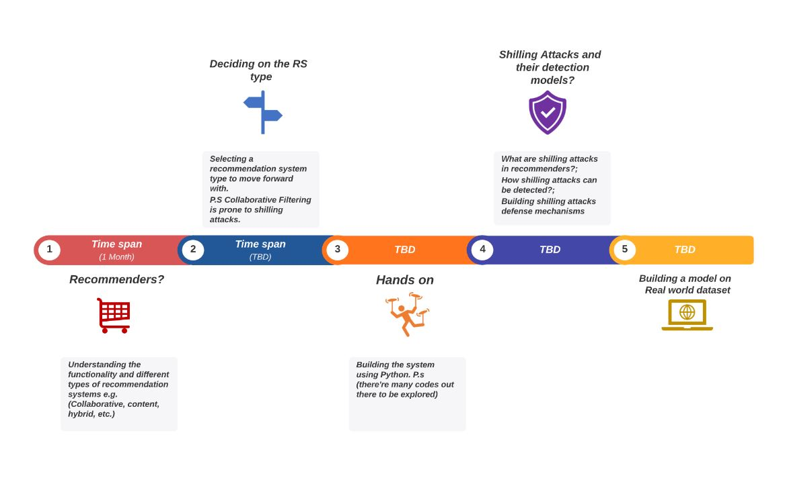
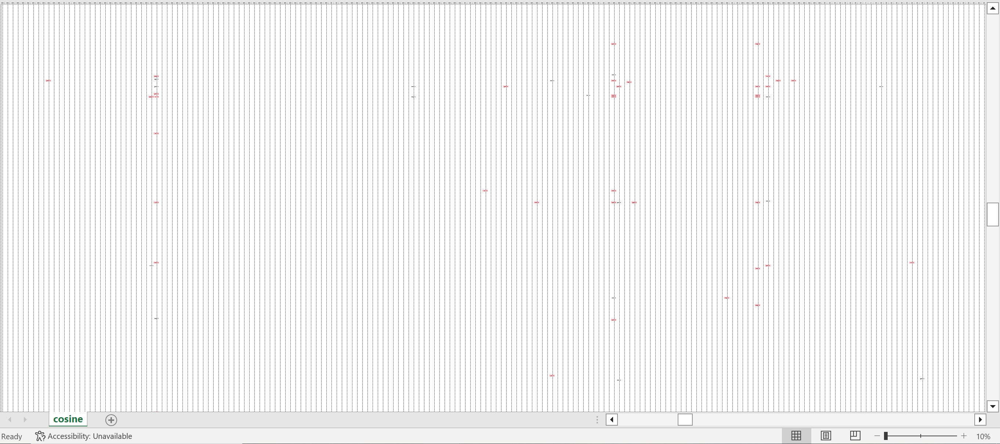
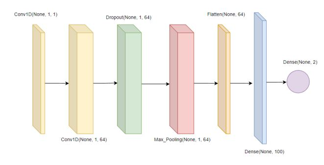
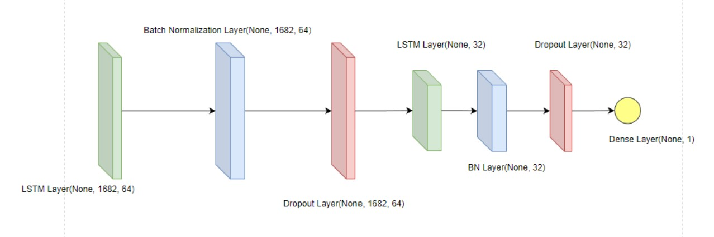
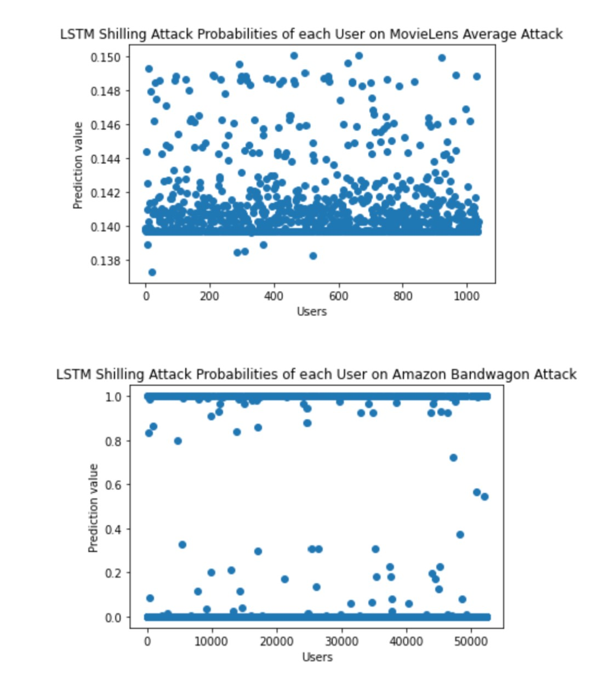
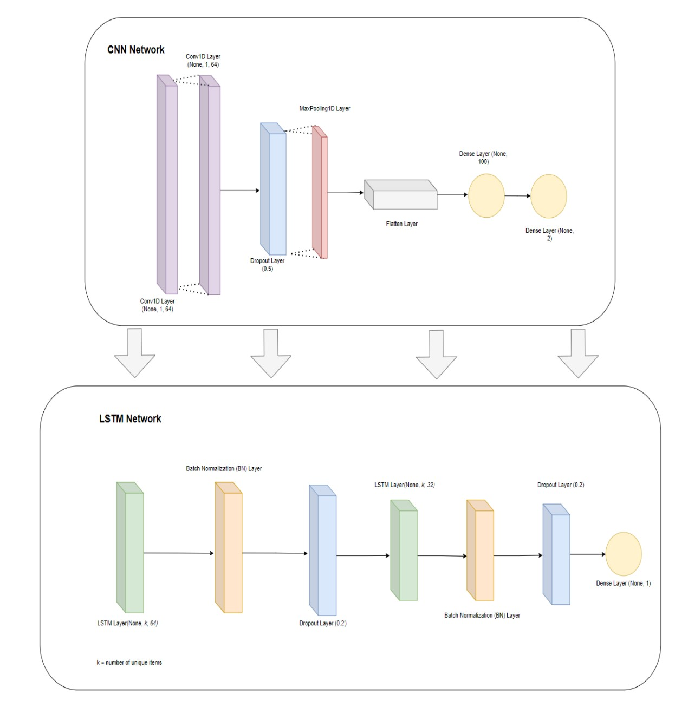
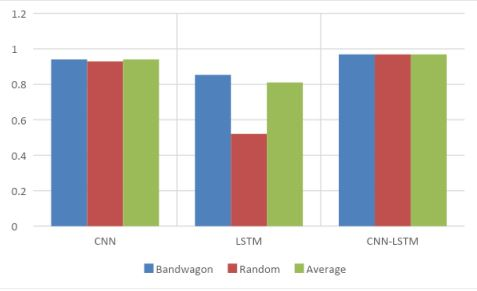
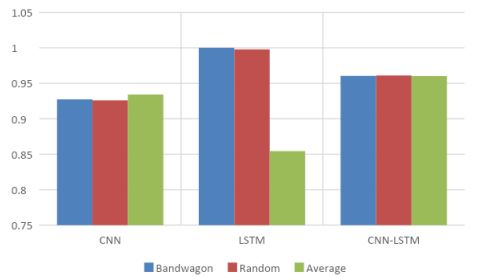

# Amazon-Recommendation-System-Shilling Attack Detector
In the e-commerce industry, online retailers like Amazon, Alibaba, eBay, etc., employ recommendation systems to reduce information overload and provide better user experience for customers while shopping online. However, recommendation systems are susceptible to malicious manipulation of recommendations known as shilling attacks which impact the accuracy, fairness, and trustworthiness of e-commerce companies resulting in negative repurcussions not only for the customer but for the broader economy.

## Links
Please see _*links.txt*_ for links to the dataset used in this repository.  
:link: [Recommendation System](https://colab.research.google.com/drive/19Qat-59Rz7laqR9NSibKeBcxBSBtFptx?usp=sharing)  
:link: [LSTM Shilling Attack Detector](https://colab.research.google.com/drive/1oA1rTGMnUxWPxsm3rWcF8cNecQDPX8yw?usp=sharing)  
:link: [CNN Shilling Attack Detector](https://colab.research.google.com/drive/1E6D4UKCTQL7YVbmplVCWP_BcgSSdCC07?usp=sharing)  
:link: [CNN-LSTM Shilling Attack Detector](https://colab.research.google.com/drive/183Z421C9Tuh52-CHn5HEmmAE9jlmpEb-?usp=sharing)

## Item-Based Collobarative-Filtering Recommendation System (ICBFRS)
Collaborative Filtering (CF) produces recommendations by evaluating the ratings of items by users. 
1) Pre-process datasets to remove incosistencies and type errors
2) Create the user-item matrix
3) Employ a similarity algorithm such as cosine and Pearson to find features/similarities between items
4) Find the top Kth nearest neighbours for an item using weighted averages of items similar to the items the user has rated

## Scikit-learn Recommendation System Library
The name SurPRISE (roughly :) ) stands for Simple Python RecommendatIon System Engine.  
We use the SurPRISE library to quickly build, train and evaluate a simple ICBFRS.
We initially implemented the ICBFRS manually, however, we did not have access to good hardware
resources to train the model and that we did not have a computationally efficient backend to handle all this processing. A _**very small**_ sample of sparse matrix is shown below where the red cells are values that are not zero. For this reason, we also moved our development environment over to Google Collab to take advantage of their hardware resources  

 

## Shilling Attacks
A shilling attack is any form of malicious intent by a user or organization on recommendation systems in order to sway the prediction model to their economic benefit and/or at the economic cost of others. There are multiple types of attacks but they can be classified either into low-level attacks and high-level attacks where high-level attacks require the attacker to know the domian knowledge in depth, whereas low-level attacks do not.  

## Shilling Attack Detectors

### Convolutional Neural Network
We went with a simple architecture for the CNN to detect shilling attacks. We utilized two convolutional layers
and two dense (fully connected) layers. This is because, through an iterative process, we learned that
adding more layers would increase the complexity of
the model adding difficulty to the training and optimization as well as the risk of overfitting the data.  

### Long Short-Term Memory
To detect these attacks, we use a Long Short-Term Memory (LSTM) network to capture contextual dependencies of users vs. shilling attackers. To do this, we first pre-process the ratings dataset into user-item vectors where each vector represents a user and all of their item ratings (any items not rated will be set to zero). Then we feed these vectors into the model with the following architecture:  

 
Finally, we cluster the predictions using k-means clustering to classify the users as either being an authentic user or a shilling attacker. A sample probability distribution graph of the predictions is shown below:  

### CNN-LSTM Hybrid
The CNN-LSTM hybrid architecture involves several components in
sequence for shilling attack detection. The first component is the CNN network which applies filters to the
user-item rating matrix to extract important spatial features in the data. The output of the CNN component is then fed
into the LSTM network. The sigmoid
activation function is used to introduce non-linearity into the model. The BatchNormalization
layer and the Dropout layer with a rate of 0.2 are added after the first LSTM layer to prevent
overfitting and to balance out the training. Finally, the output is reshaped and sent to a Dense
layer for classification of the input data.  

## Results
In terms of the F-measure metric, the CNN-LSTM model consistently outperforms the CNN model on both datasets for all attacks. The CNN and CNN-LSTM models show consistent performance across all attack types. The LSTM model achieves the highest score for the bandwagon attack but is inconsistent overall. From the results, we draw conclusions that the LSTM model performs better on the Amazon dataset due to its sensitivity to data sparsity and detecting shilling users based on the deviation of prediction values while the CNN model is strong in extracting features and correlation while being a stable model. The LSTM-CNN hybrid model proves to be the most effective in detecting multiple attacks, combining the strengths of both models.  
### Bar Chart of CNN, LSTM, CNN-LSTM Shilling Detector Performance on F-measure, 100K MovieLens Appliance Infected Datasets

### Bar Chart of CNN, LSTM, CNN-LSTM Shilling Detector Performance on F-measure, 50K Amazon Appliance Infected Datasets

